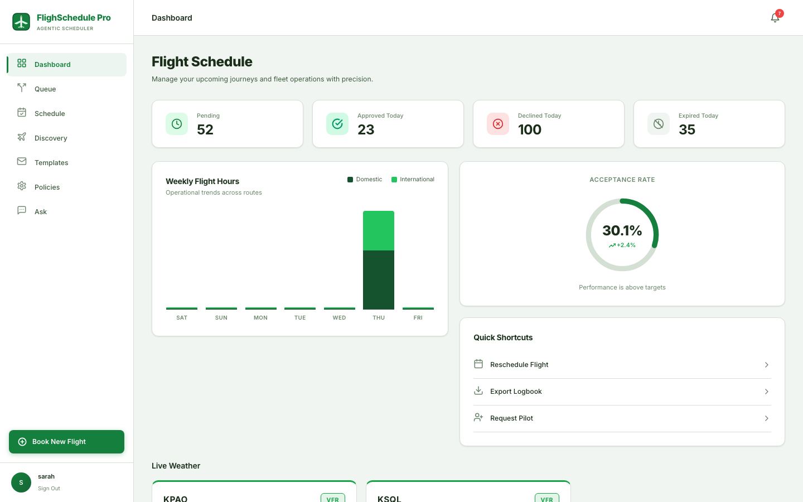
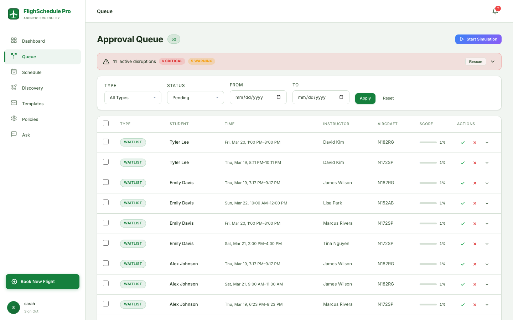
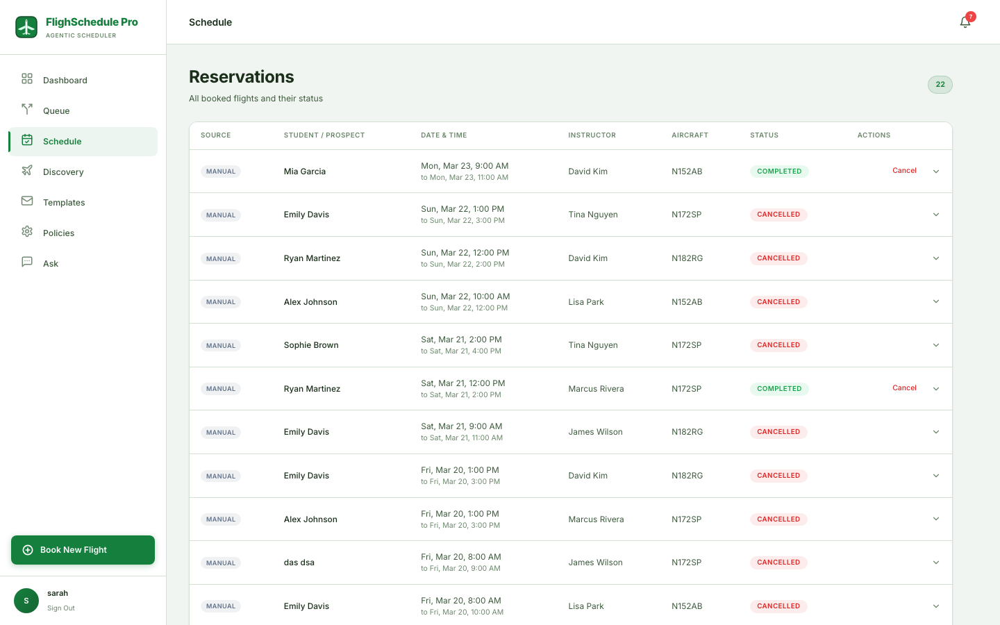
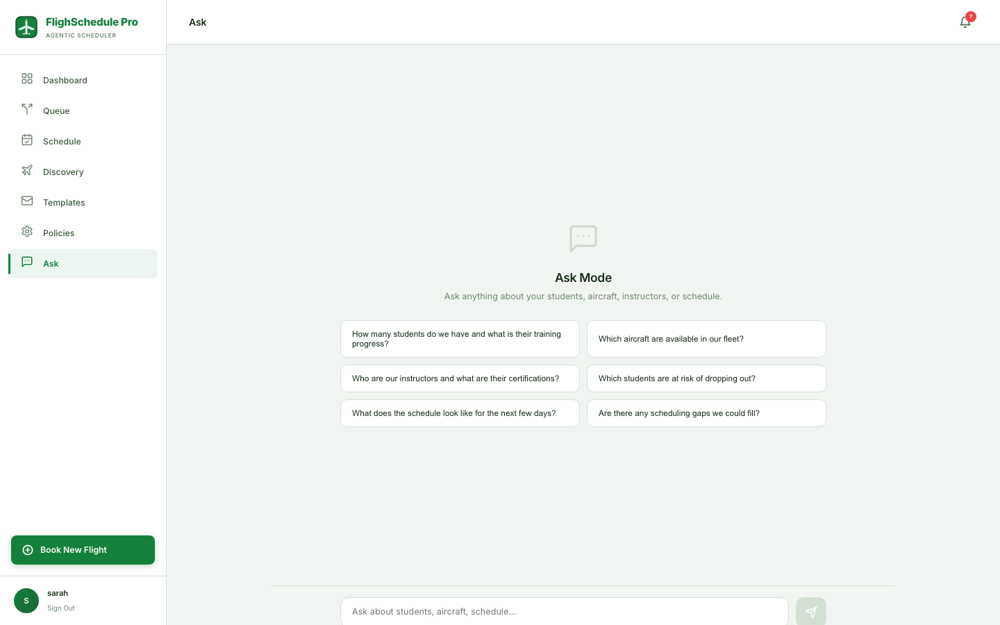
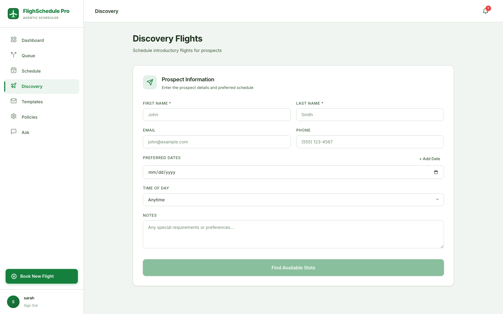
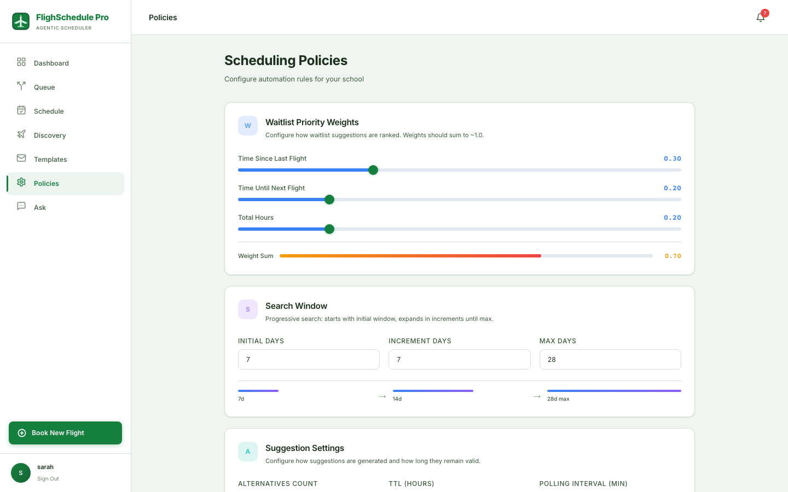
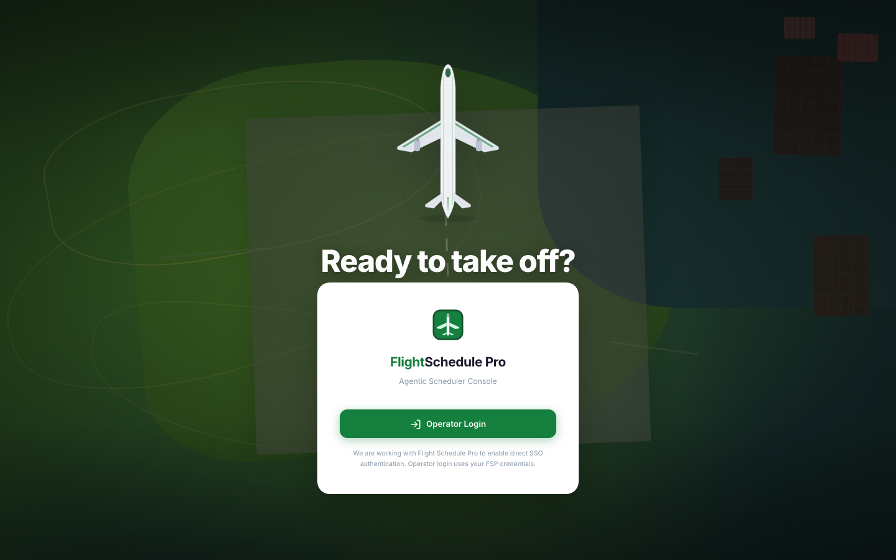

# FlighSchedule Pro

**Agentic scheduling automation for flight schools** — detects schedule openings, generates AI-powered booking suggestions, and lets schedulers approve them with a single click.

Built to integrate with [Flight Schedule Pro (FSP)](https://www.flightschedulepro.com/), the industry-standard flight school management system.

**Live App:** [https://fsp-web-production.up.railway.app](https://fsp-web-production.up.railway.app)



---

## Features

### Approval Queue

Review AI-generated scheduling suggestions with full context — student progress, instructor availability, aircraft assignment, and AI risk assessment. Approve or decline individually or in bulk.



### Schedule View

See all reservations across students, instructors, and aircraft. Track completed, cancelled, and upcoming flights in one place.



### Ask Mode (AI Chat)

Natural language interface to query your school's data. Ask about student progress, aircraft availability, scheduling gaps, at-risk students, and more. Powered by Claude Haiku with full database context.



### Discovery Flights

Manage discovery flight intake — schedulers enter prospect details and the system finds optimal slots based on instructor and aircraft availability.



### Scheduling Policies

Configure per-operator scheduling rules: waitlist priority weights, search windows, suggestion TTL, polling intervals, and notification preferences.



### Additional Features

- **AI Rationale** — Every suggestion includes an AI-generated explanation and risk assessment
- **Disruption Detection** — Automatic alerts for weather, maintenance, and instructor unavailability
- **Student Insights** — Tracks inactive students, checkride readiness, and at-risk indicators
- **Live Weather** — METAR-based weather widgets with VFR/IFR flight category indicators
- **Flight Alerts** — Real-time notifications for overdue returns, safety events, and maintenance
- **Multi-Tenant** — Strict operator-level data isolation with per-tenant configuration
- **Simulation Engine** — Test scheduling scenarios before deploying to production

---

## Tech Stack

| Layer               | Technology                                             |
| ------------------- | ------------------------------------------------------ |
| **API**             | TypeScript, NestJS (Fastify), Node.js 20 LTS           |
| **Frontend**        | Next.js 15, React 19, GSAP animations                  |
| **Database**        | PostgreSQL 16 (Drizzle ORM)                            |
| **Queue**           | BullMQ + Redis 7                                       |
| **AI**              | Claude Haiku 4.5 (OpenRouter), GPT-4.1-nano (fallback) |
| **Deployment**      | Railway (Docker containers)                            |
| **Package Manager** | pnpm 9                                                 |

---

## Architecture

```
┌──────────────────────────────────────────────────────┐
│                   Next.js Frontend                   │
│              (fsp-web / port 3000)                   │
└──────────────────────┬───────────────────────────────┘
                       │ HTTPS
┌──────────────────────▼───────────────────────────────┐
│                  NestJS API                          │
│             (fsp-app / port 3001)                    │
│                                                      │
│  ┌──────────┐ ┌──────────┐ ┌──────────┐              │
│  │   Auth   │ │Suggestions│ │  Ask AI  │  ...17      │
│  │  Module  │ │  Module   │ │  Module  │  modules    │
│  └──────────┘ └──────────┘ └──────────┘              │
└────────┬─────────────┬──────────────┬────────────────┘
         │             │              │
    ┌────▼────┐  ┌─────▼─────┐  ┌────▼────┐
    │PostgreSQL│  │   Redis  │  │  FSP    │
    │  (data) │  │  (BullMQ) │  │  API    │
    └─────────┘  └───────────┘  └─────────┘
                       │
                 ┌─────▼─────┐
                 │  BullMQ   │
                 │  Worker   │
                 │ (jobs)    │
                 └───────────┘
```

**Services:**

- **fsp-app** — NestJS API + BullMQ Worker (runs in single container)
- **fsp-web** — Next.js standalone frontend
- **PostgreSQL** — Primary data store (Railway managed)
- **Redis** — Job queue backend (Railway managed)

---

## Getting Started

### Prerequisites

- Node.js 20+
- pnpm 9+
- PostgreSQL 16
- Redis 7

### Setup

```bash
# Clone
git clone https://github.com/spathak-droid/FlighSchedulePro.git
cd FlighSchedulePro

# Install dependencies
pnpm install

# Copy environment file
cp env.example .env.local

# Push database schema
pnpm db:push

# Start all services (API + Worker + Web)
pnpm dev
```

This starts:

- **API** at `http://localhost:3001/api/v1`
- **Worker** (BullMQ job processor)
- **Web** at `http://localhost:3000`

### Local Database (Docker)

```bash
docker compose up -d
```

Starts PostgreSQL 16 and Redis 7 locally with default credentials matching `env.example`.

---

## Environment Variables

| Variable                  | Description                           | Required              |
| ------------------------- | ------------------------------------- | --------------------- |
| `DATABASE_URL`            | PostgreSQL connection string          | Yes                   |
| `REDIS_HOST`              | Redis hostname                        | Yes                   |
| `REDIS_PORT`              | Redis port                            | Yes                   |
| `REDIS_PASSWORD`          | Redis password                        | If auth enabled       |
| `JWT_SECRET`              | JWT signing secret                    | Yes                   |
| `ENCRYPTION_KEY`          | Token encryption key (64 hex chars)   | Yes                   |
| `FSP_MOCK_MODE`           | Enable mock FSP data (`true`/`false`) | No (default: `false`) |
| `FSP_API_BASE_URL`        | FSP auth/gateway base URL             | When mock mode off    |
| `FSP_CORE_BASE_URL`       | FSP core API base URL                 | When mock mode off    |
| `FSP_CURRICULUM_BASE_URL` | FSP curriculum API base URL           | When mock mode off    |
| `FSP_SUBSCRIPTION_KEY`    | FSP API subscription key              | When mock mode off    |
| `OPEN_ROUTER_API_KEY`     | OpenRouter API key (for Claude)       | For AI features       |
| `OPENAI_API_KEY`          | OpenAI API key (fallback)             | For AI features       |
| `FRONTEND_URL`            | Frontend URL for CORS                 | Production            |
| `RESEND_API_KEY`          | Resend API key for emails             | For notifications     |

---

## Scripts

```bash
pnpm dev              # Start all services in dev mode
pnpm build            # Build API + Web for production
pnpm build:api        # Build NestJS API only
pnpm build:web        # Build Next.js frontend only

pnpm test             # Run all tests
pnpm test:unit        # Run unit tests only
pnpm test:integration # Run integration tests only
pnpm test:e2e         # Run Playwright E2E tests

pnpm lint             # Lint TypeScript files
pnpm lint:fix         # Lint and auto-fix
pnpm typecheck        # TypeScript type checking
pnpm format           # Format with Prettier

pnpm db:generate      # Generate Drizzle migrations
pnpm db:migrate       # Run migrations
pnpm db:push          # Push schema to database
```

---

## Deployment (Railway)

The app is deployed as two services on [Railway](https://railway.app):

| Service     | Dockerfile       | Port | URL                                 |
| ----------- | ---------------- | ---- | ----------------------------------- |
| **fsp-app** | `Dockerfile`     | 3001 | `fsp-app-production.up.railway.app` |
| **fsp-web** | `Dockerfile.web` | 3000 | `fsp-web-production.up.railway.app` |

### Manual Deploy

```bash
# Install Railway CLI
npm i -g @railway/cli

# Login & link project
railway login
railway link

# Deploy both services
railway up -s fsp-app -d
railway up -s fsp-web -d
```

### Auto Deploy

Connect your GitHub repo in the Railway dashboard under each service's **Settings > Source > Connect Repo**. Pushes to the configured branch will auto-trigger builds.

---

## Project Structure

```
FlighSchedulePro/
├── src/
│   ├── api/                    # NestJS API application
│   │   ├── main.ts             # Entry point (Fastify adapter)
│   │   ├── app.module.ts       # Root module
│   │   ├── common/             # Guards, filters, interceptors, middleware
│   │   ├── fsp/                # FSP API client + mock router
│   │   │   └── mock/           # Mock data for all FSP endpoints
│   │   └── modules/            # Feature modules
│   │       ├── ask/            # AI chat (Ask Mode)
│   │       ├── auth/           # Login, MFA, JWT
│   │       ├── suggestions/    # Scheduling suggestions + approval
│   │       ├── dashboard/      # Stats & analytics
│   │       ├── discovery/      # Discovery flight intake
│   │       ├── disruptions/    # Disruption detection
│   │       ├── insights/       # Student insights engine
│   │       ├── ai/             # AI rationale generation
│   │       ├── weather/        # Weather observations
│   │       ├── alerts/         # Flight alerts
│   │       ├── policies/       # Scheduling policies
│   │       ├── notifications/  # Email/SMS notifications
│   │       ├── resources/      # Resource lookups
│   │       ├── simulation/     # Scheduling simulation
│   │       ├── solver/         # Auto-scheduler solver
│   │       └── ...
│   ├── worker/                 # BullMQ job processors
│   ├── core/                   # Scheduling logic, ranking, types
│   └── db/                     # Drizzle ORM schema + migrations
├── web/                        # Next.js 15 frontend
│   ├── app/                    # App Router pages
│   │   ├── login/              # Login page
│   │   └── (authenticated)/    # Protected pages
│   │       ├── dashboard/
│   │       ├── queue/
│   │       ├── reservations/
│   │       ├── discovery/
│   │       ├── ask/            # AI chat interface
│   │       ├── templates/
│   │       └── policies/
│   ├── components/             # React components
│   └── lib/                    # API client, auth, types
├── tests/
│   ├── unit/                   # Vitest unit tests
│   ├── integration/            # Vitest integration tests
│   └── e2e/                    # Playwright E2E tests
├── Dockerfile                  # API + Worker production image
├── Dockerfile.web              # Web frontend production image
├── docker-compose.yml          # Local dev (Postgres + Redis)
└── docs/screenshots/           # App screenshots
```

---

## FSP Integration

FlighSchedule Pro integrates with the [FSP API](https://www.flightschedulepro.com/) for:

- **Authentication** — Bearer token via `POST /common/v1.0/sessions/credentials`
- **Schedule Polling** — Detects changes every 2-5 minutes
- **Reservation Management** — Validate-then-create pattern
- **Resource Sync** — Students, instructors, aircraft, locations, enrollments

All FSP calls go through a rate-limited client (~100 req/min per operator). Set `FSP_MOCK_MODE=true` to use built-in mock data for development.

---

## Login

**Test credentials** (mock mode):

| Email               | Password  |
| ------------------- | --------- |
| `sarah@skywest.edu` | any value |

Or use the **Test Login** button on the login page.



---

## License

Private. All rights reserved.
